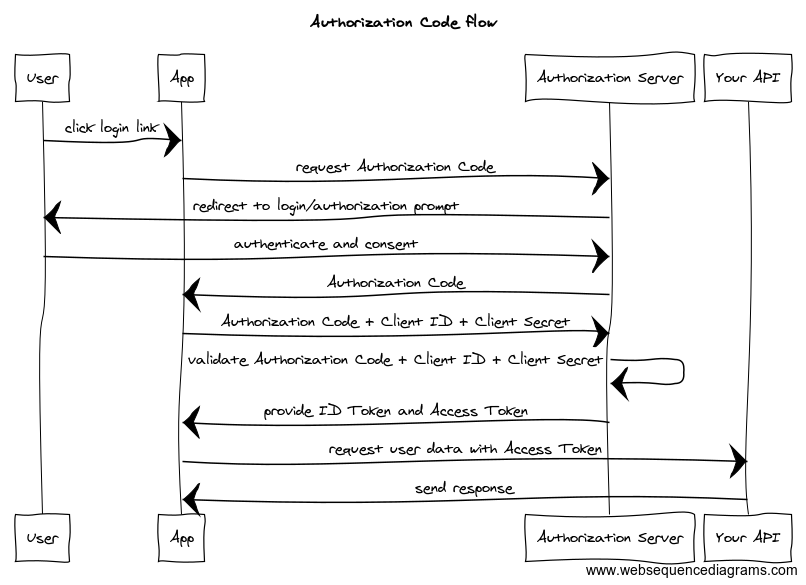

# JWT Guard
{: .no_toc }
JWT Guard is a free, open source, test suite written in C# for testing the security of JSON Web Token (JWT) implementations. It is designed to be used primarily by developers to test if their ASP.NET Core Web APIs are properly validating JWT access tokens.

## Table of Contents
{: .no_toc .text-delta }

1. TOC
{:toc}

## What does JWT Guard do for you?

When you have a client application that interacts with your API, you typically rely on an OAuth 2.0 flow where an 
authorization server issues access tokens for the client (or the user using that client), to access a specific resource 
server, also known as your API:



*Example of "Authorization code flow" to retrieve an access token for an API resource. Image courtesy of [Postman](https://blog.postman.com/pkce-oauth-how-to/).*

The easiest way to implement this flow and to protect your API when using ASP.NET Core, is to use the 
[Microsoft.AspNetCore.Authentication.JwtBearer](https://www.nuget.org/packages/Microsoft.AspNetCore.Authentication.JwtBearer) NuGet package.
Likewise, for other programming languages and web frameworks, similar open-source solutions exist.

While it's a good practice to use well-known solutions for a problem, you're also placing your trust in an open-source
package to protect your API resources. 

And this is where JWT Guard can help you: by adding the JWT Guard test suite to your project,
you can automatically verify on each build of your API, that the JWT validation logic still functions as expected.
To do so, JWT Guard adds some specific test cases to your solution to validate that:
- valid JWT access tokens are accepted by a protected endpoint of your API.
- invalid JWT access tokens are being rejected.

## How does JWT Guard work?

Every test in the JWT Guard test suite is an integration test against your API. When a test runs, your API is started in 
the background and the JWT Guard test will attempt to access the configured target API endpoint with a variety of 
JWT access tokens. For more information about how to configure JWT Guard, see [Test Settings](test-settings.md).

To issue these tokens, JWT Guard spins up its own token issuer service [^1] and slightly reconfigures your API to 
trust tokens issued by this token service, by changing the `JwtBearerOptions.Authority` and
`TokenValidationParameters.ValidIssuer` parameters respectively.

Now, you might think that you're placing your trust in yet another open-source solution that claims to improve your 
API's security, and you're correct in doubting that trust. JWT Guard is completely open-source, so you can verify every
line of code. Furthermore, when you add JWT Guard to your project, you actually have a full copy of the code in your 
own solution. 

So feel free to:
- make changes to any of the tests to better fit your API
- replace JWT Guard's token issuer service and connect with your own service instead
- and so on...

## Getting started

To get started, you'll need to first install the JWT Guard project template by using the `dotnet` CLI:

```bash
dotnet new install JWTGuard.Template
```

This allows you to use either `dotnet new jwt-guard` or use Visual Studio to add a JWT Guard test project to your existing solution. Using the `dotnet` CLI, you can add a JWT Guard test project by using the following command:

```bash
dotnet new jwt-guard --apiProject ..\\relative\\path\\to\\your\\webapi.csproj
```

Or, using the shorthand notation:

```bash
dotnet new jwt-guard -ap ..\\relative\\path\\to\\your\\webapi.csproj
```

This will add the JWT Guard test project to your solution and configure it to test the specified Web API project.
The test project will be added to the solution in its own folder, so you probably want to start the relative path to your Web API project with `../`, for example, `../MyApi/MyApi.csproj`.

## Configuring JWT Guard

Before you can run the JWT Guard test suite, you'll most likely need to update some settings and perhaps add a few lines of code to your API project. Let's step through these steps.

### 1. Configuring the target API testing endpoint

JWT Guard needs to perform its tests against a secured API endpoint to verify the functionality of the JWT Bearer token middleware used by ASP.NET Core. By default, it is configured use the API endpoint `/weatherforecast`, but you can very easily override this setting by going into the `TestSettings.cs` file.

At the top of the file, you can override the default test settings in the static constructor. For example, if target endpoint in your API is `/your-secure-api-endpoint`, your configuration would look like this:

```csharp
public readonly struct TestSettings
{
    /// <summary>
    /// Static constructor for the <see cref="TestSettings"/> struct.
    /// </summary>
    static TestSettings()
    {
        // Override the default test settings here
        CurrentTestSettings = DefaultTestSettings with
        {
            TargetUrl = "/your-secure-api-endpoint"
        };
    }

    // ... the rest remains as-is.
}
```

More information about the different test settings can be found at [Test Settings]().

### 2. Make your API project compatible with the JWT Guard test project

JWT Guard contains integration tests, which uses a `WebApplicationFactory` implementation to run the Web API project during each test run. For this to work correctly, the factory class needs to be able to find the Web API project's `Program` class. Newer C# projects using top-level statements, however, have no explicit `Program` class. If your project uses top-level statements, you'll need to add a partial `Program` class:

```csharp
// ... contents of your Program.cs

public partial class Program {}
```

That should be enough in order to run the JWT Guard test suite! In case you encounter issues, we have documented the most
frequently occuring ones in the [Troubleshooting section]().

----

[^1]: JWT Guard uses [Duende IdentityServer](https://duendesoftware.com/products/identityserver) as its token issuer service because it's a well-known
and certified OAuth 2.0 solution. While it's not free for use in commercial products, it is free to use for testing purposes.